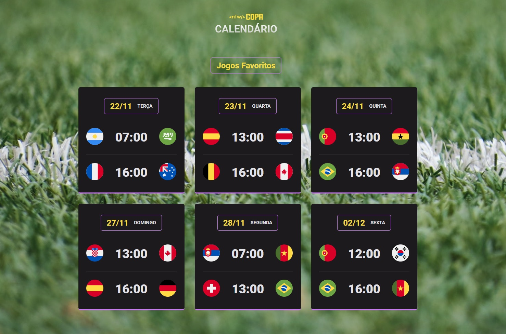
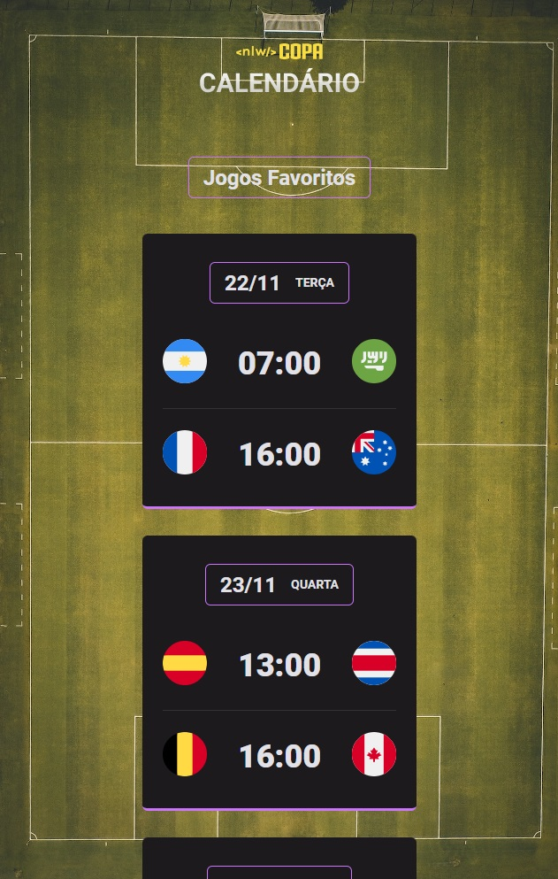
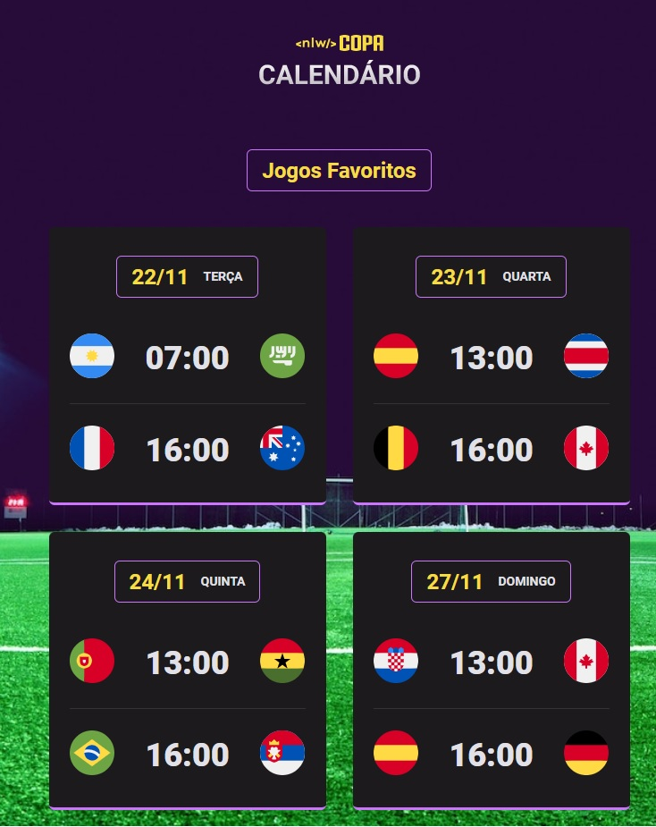

# Projeto NLW Copa



* Esse projeto foi desenvolvido durante o evento da NLW, da Rocketseat.
* O objetivo é praticar um pouco dos conceitos básicos do desenvolvimento web, com foco no front-end.

## Tecnologias usadas

* [HTML5](https://developer.mozilla.org/pt-BR/docs/Web/HTML)

* [CSS3](https://developer.mozilla.org/pt-BR/docs/Web/CSS)

* [JS](https://developer.mozilla.org/pt-BR/docs/Web/JavaScript)

## Status do projeto

* No momento ele está concluído, mas, toda sugestão é bem vinda!

## Resultado

* Em telas mobile o site ficou assim:


* Para telas maiores, como tablet's, o site se apresenta um pouco diferente:


* E para desktop e telas maiores o site fica como está na imagem do topo deste README.

* Para acessar o projeto completo acesse o link abaixo:
* [Projeto NLW Copa](https://lucas-biel.github.io/nlw-copa/)

* Ou, se preferir, você pode clonar o projeto para a sua máquina e executar o arquivo index no seu navegador.
* Use o comando no terminal:

```
git clone https://github.com/lucas-biel/nlw-copa.git
```
  
## Autor

* [Lucas Santos](https://github.com/lucas-biel)

## Licença

* [MIT](https://github.com/lucas-biel/nlw-copa/blob/main/LICENSE)